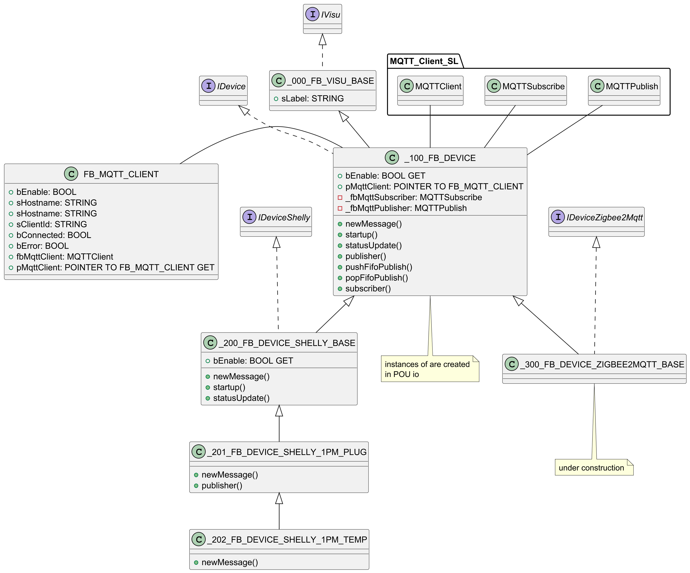

# xlh-ha (Home Automation)

Home automation built on **CODESYS** (`codesys/xlh_ha_00_02.project`), running on a Raspberry Pi
(*CODESYS Control for Raspberry Pi 64 SL*). Smart-home devices (Zigbee sensors/actuators and Shelly
devices) are integrated over **MQTT**: Zigbee devices via a [Zigbee2MQTT](https://www.zigbee2mqtt.io/)
gateway, Shelly devices via their native MQTT/JSON-RPC interface. The PLC application models every
physical device as a function block instance and wires them together with plain PLC logic.

UML diagram


## System context

`compose_xlh_ha.yml` provides the surrounding services as Docker containers:

| Service | Container | Port | Purpose |
|---|---|---|---|
| Eclipse Mosquitto | `xlh_ha_mosquitto` | 1883 | MQTT broker (used by the PLC and Zigbee2MQTT) |
| Zigbee2MQTT | `xlh_ha_zigbee2mqtt` | 8100 (frontend) | Zigbee ↔ MQTT gateway (Zigbee USB adapter on `/dev/ttyUSB0`) |
| Node-RED | `xlh_ha_node_red` | 1880 | Optional flow-based automation / dashboards |

The CODESYS runtime connects to the broker on `localhost:1883` (MQTT 3.1.1 over TCP, via the
`MQTT Client SL` library).

## Project structure (`codesys/xlh_ha_00_02.project`)

```
xlh_base (CODESYS Control for Raspberry Pi 64 SL)
└── app
    ├── Task Configuration
    │   ├── MainTask:  LOCAL_TIME_AND_TIME_ZONE, TASK_INFO, io, MAIN
    │   └── VISU_TASK: WebVisu
    ├── MAIN                  Entry point, calls LOGIC
    ├── LOGIC                 Device interconnections (graphical, CFC/FBD)
    ├── VISUALIZATION         WebVisu screens
    └── IoT
        ├── GC                Global constants (string/buffer sizes)
        ├── TASK_INFO         Runtime task diagnostics (cycle time, jitter)
        ├── LOCAL_TIME_AND_TIME_ZONE  UTC → CET/CEST local time
        ├── FUNCTIONS         FB_IMPULSE_SWITCH (impulse relay)
        ├── MQTT_Client       FB_MQTT_CLIENT + JSON/string helper functions
        └── DEVICES           Device class hierarchy + VISU counterparts
```

## Runtime architecture

### `MAIN` / `io` programs

`MAIN` is the entry point of `MainTask` and only calls `LOGIC`, where the device
interconnections are modeled graphically (CFC/FBD). The `io` and diagnostics programs are called
directly by the task configuration.

`io` is the central device program. It instantiates all Zigbee2MQTT/Shelly devices (as
`VAR_INPUT`, so they can be parameterized online / from the visualization), binds them to shared
`FB_MQTT_CLIENT` instances, and calls them cyclically:

- Devices are not tied directly to one MQTT client but managed through a pointer array
  (`_aIoClients`, up to 100 devices).
- Several `FB_MQTT_CLIENT` instances (up to 20) are used so the MQTT library is not overloaded by
  too many parallel subscriptions — 5 devices share one MQTT client
  (`iNR_OF_IO_TO_ONE_MQTT_CLIENT`).
- One-time startup block: register devices in the pointer array, assign each MQTT client a unique
  client id (`xlh_base_ha_io_<n>`), bind the devices to their client and call `startup()`, then
  enable all clients.
- Cyclic part: MQTT clients are called first (so subscribers/publishers see an up-to-date
  connection state), then all devices.

Device instances configured in `io`:

| Instance | Function block | MQTT topic base |
|---|---|---|
| `fbSwitch1` | `_343 …HUE_SWITCH_DIMMER` | `switch_1` |
| `fbSwitch2` | `_345 …HUE_WALL_SWITCH` | `switch_2` |
| `fbTempHumSensor` | `_341 …SONOFF_TEMP_HUM` | `temp_hum_sensor` |
| `fbMotionSensor` | `_344 …HUE_MOTION` | `motion_sensor` |
| `fbLamp1` / `fbLamp2` | `_312 …Z2M_POWER_LAMP` | `lamp_1` / `lamp_2` |
| `fbPlug1` | `_310 …Z2M_POWER_SWITCH` | `plug_1` |
| `fbPlug2` | `_311 …IKEA_INSPELING` | `plug_2` |
| `fbShelly1` | `_313 …Z2M_SHELLY_1PM` | `shelly_1` |
| `fbShelly2` | `_314 …Z2M_SHELLY_EM` | `shelly_2` |

### `LOGIC` program

Graphically modeled interconnection of the devices. Button events from the wireless switches
(e.g. `io.fbSwitch1.bOnPress`) drive `FB_IMPULSE_SWITCH` instances, which toggle the on-request of
lamps, plugs and the Shelly relay through their `pbOn` pointers.

### `FB_IMPULSE_SWITCH` (FUNCTIONS)

Impulse relay (latching switch) with push-button and impulse inputs, plus additional ON/OFF
inputs, a maximum on-time and an impulse memory:

- `bImpulse`: rising edge toggles the state and sets the impulse memory, so a subsequent
  button release does not switch off.
- `bButton`: rising edge switches on; falling edge switches off *unless* the impulse memory is set.
- `bOn` / `bOff`: force ON / OFF statically; `bEnable = FALSE` forces OFF and blocks all actions.
- `tTimeOnMax` (default 120 min): maximum on-time, then automatic switch-off.
- `tTimeImpulseMemory` (default 60 min): lifetime of the impulse memory.
- Writes directly to the external variable referenced by `pbOn`, so several independent inputs can
  act on one shared setpoint variable.

## MQTT layer (`IoT/MQTT_Client`)

### `FB_MQTT_CLIENT`

Wrapper around the `MQTT Client SL` library's `MQTT.MQTTClient`. Provides a simplified interface
(`bEnable` / `sHostname` / `sClientId`, defaults: `localhost`, port 1883, MQTT 3.1.1 over TCP) and
returns connection and error flags. On an active error flag, enable is automatically dropped so the
library can reset internally.

- `pMqttClient` (property): pointer to the internal MQTT client — used by device FBs to attach
  their own subscribe/publish blocks to the same connection.
- `setClientIdNr()`: builds a unique client id by appending a sequential number to a base name.

### Helper functions

- `GET_VALUE_FROM_MSG` — extracts the value of a JSON property from a received MQTT message.
  Searches for the pattern `"key":` and returns the value up to the next `,` or `}`; string values
  are returned without the surrounding quotes. Simple string parsing, not a full JSON
  implementation — nested objects are read with a suffix trick in the key, e.g.
  `sKey := 'temperature":{"tC'` for `{"temperature":{"tC":21.0}}`. Returns `''` if not found.
- `GET_BOOL/INT/REAL/LREAL/STRING_FROM_VALUE`, `GET_BOOL_FROM_VALUE_ON_OFF` — convert the extracted
  value string to a typed value, keeping the previous value if the string is empty/invalid.
- `TERMINATE_STRING` — guarantees null-termination of received/copied string buffers.

### `GC` — global constants

Project-wide string sizes for MQTT topics and message buffers (`STRING_SIZE_TOPIC` = 1024,
`STRING_SIZE_MESSAGE_TX` = 1024, `STRING_SIZE_MESSAGE_RX` = 2048). Changes affect the memory
footprint of every device FB.

## Device class hierarchy (`IoT/DEVICES`)

Naming convention: `_0xx` visualization base, `_1xx` generic MQTT device, `_2xx` Shelly (native
MQTT/JSON-RPC), `_3xx` Zigbee2MQTT (`_31x` mains-powered actuators, `_34x` battery devices).
`IVisu`, `IDevice`, `IDeviceShelly`, `IDeviceZigbee2Mqtt` are marker interfaces. Each user-facing
device FB has a matching `VISU_…` block in `DEVICES/VISU` for the WebVisu.

```
_000_FB_VISU_BASE (IVisu)
└── _100_FB_DEVICE (IDevice)
    ├── _200_FB_DEVICE_SHELLY_BASE (IDeviceShelly)
    │   └── _201_FB_DEVICE_SHELLY_1PM_PLUG
    │       └── _202_FB_DEVICE_SHELLY_1PM_TEMP
    └── _300_FB_DEVICE_Z2M_BASE (IDeviceZigbee2Mqtt)
        ├── _310_FB_DEVICE_Z2M_POWER_SWITCH
        │   ├── _311_FB_DEVICE_Z2M_POWER_SWITCH_IKEA_INSPELING
        │   ├── _312_FB_DEVICE_Z2M_POWER_LAMP
        │   └── _313_FB_DEVICE_Z2M_SHELLY_1PM
        ├── _314_FB_DEVICE_Z2M_SHELLY_EM
        └── _340_FB_DEVICE_Z2M_BATTERY
            ├── _341_FB_DEVICE_Z2M_BATTERY_SONOFF_TEMP_HUM
            ├── _342_FB_DEVICE_Z2M_BATTERY_AQARA_SWITCH_H1
            ├── _343_FB_DEVICE_Z2M_BATTERY_HUE_SWITCH_DIMMER
            ├── _344_FB_DEVICE_Z2M_BATTERY_HUE_MOTION
            └── _345_FB_DEVICE_Z2M_BATTERY_HUE_WALL_SWITCH
```

### `_000_FB_VISU_BASE`

Visualization base FB. Provides a label string (`sLabel`) and a set of local "dummy" variables
that derived FBs use to make values accessible for online watch / trace without referencing them
explicitly in method bodies. No cyclic code of its own.

### `_100_FB_DEVICE` — generic MQTT device base class

Connects one MQTT subscriber and one MQTT publisher instance to an externally referenced
`FB_MQTT_CLIENT` and provides a publish queue.

Usage: assign `pMqttClient` and `sMqttTopicBase` in the calling program, call `startup()` once
(topic filters are built), then set `bEnable := TRUE` — the subscriber subscribes to
`<base>/#` and calls `newMessage()` for every received message.

Hooks overridden by derived FBs:

- `newMessage()` — parse the message and update outputs (base stores the receive time for diagnostics).
- `publisher()` / `pushFifoPublish()` — enqueue MQTT messages to be published.
- `statusUpdate()` — called once on every subscriber (re-)connect, e.g. to send an active status query.

Publish queue: fixed depth of 30 entries; non-blocking push (returns `FALSE` and drops the message
when full); a cycle-delay counter (5 cycles) between pops prevents back-to-back publishes from
overloading the broker and MQTT library; a fill-level watermark is kept for diagnostics.

Subscriber lifecycle: enabled on broker connect, disabled on error/disconnect; a 3 s watchdog
briefly disables a subscriber that is enabled but not busy (library reset), a 500 ms delay
re-enables it after reconnect.

### `_200_FB_DEVICE_SHELLY_BASE` — Shelly devices (Plus/Pro generation, JSON-RPC over MQTT)

Topic layout (assigned in the Shelly device configuration):

```
<base>/rpc            → publish: JSON-RPC requests to the device
<base>/events/rpc     → subscribe: events pushed by the device
<base>/status/rpc     → subscribe: responses to Shelly.GetStatus
```

Sends a periodic `Shelly.GetStatus` query every 300 s; `newMessage()` extracts generic fields
(PCB temperature, WLAN RSSI, SSID, MAC/BSSID).

| FB | Device | Specifics |
|---|---|---|
| `_201 …SHELLY_1PM_PLUG` | Shelly Plus 1PM (plug with power metering) | Relay control via `Switch.Set`; outputs for voltage/current/power; integrates its own cumulative energy counter (`fElectricalEnergy`, resettable). Publishes on request change or when request and reported state disagree for too long (re-sync). |
| `_202 …SHELLY_1PM_TEMP` | Shelly Plus 1PM + temperature add-on | Adds three external temperature sensors (`temperature:100/101/102`) and their mean value. |

### `_300_FB_DEVICE_Z2M_BASE` — Zigbee2MQTT devices

Provides the standard Zigbee2MQTT topics and parses the common `linkquality` field:

```
zigbee2mqtt/<base>        → event topic (status pushes from the device)
zigbee2mqtt/<base>/set    → publish: action to the device   e.g. {"state":"ON"}
zigbee2mqtt/<base>/get    → publish: trigger a status query e.g. {"state":""}
```

Mains-powered actuators:

| FB | Device | Specifics |
|---|---|---|
| `_310 …POWER_SWITCH` | Generic Z2M switch actuator (plug, relay) | Publishes `{"state":"ON"\|"OFF"}` on request change or on prolonged request/state mismatch; periodic status query; exposes `pbOn` pointer so external logic (`FB_IMPULSE_SWITCH`) can drive the request directly. |
| `_311 …IKEA_INSPELING` | IKEA INSPELNING (E2206) smart plug | Adds power / voltage / current / energy readings. |
| `_312 …POWER_LAMP` | Z2M lamp (e.g. IKEA TRADFRI) | Brightness and color temperature; values received from the device are mirrored to the outputs and written back on external change (visualization). |
| `_313 …Z2M_SHELLY_1PM` | Shelly 1PM paired via Zigbee | Like `_310`, plus power / voltage / current / energy / mains frequency. |
| `_314 …Z2M_SHELLY_EM` | Shelly EM energy meter via Zigbee | Measurement only, no switching — derived directly from `_300`. |

Battery devices (`_340 …Z2M_BATTERY` adds the `battery` 0–100 % field):

| FB | Device | Specifics |
|---|---|---|
| `_341 …SONOFF_TEMP_HUM` | Sonoff SNZB-02D temperature/humidity sensor | Offset correction inputs for temperature and humidity. |
| `_342 …AQARA_SWITCH_H1` | Aqara H1 wireless wall switch | Single/double/triple press for left / right / both buttons. |
| `_343 …HUE_SWITCH_DIMMER` | Philips Hue dimmer switch (On/Off/Up/Down) | Press / hold / release action per button. |
| `_344 …HUE_MOTION` | Philips Hue outdoor motion sensor | Occupancy, illuminance, temperature; `bOccupancyDelay` with configurable off-delay and `bOccupancyDelayTod` additionally gated by a time-of-day window (may span midnight, default 18:00–08:00). |
| `_345 …HUE_WALL_SWITCH` | Philips Hue wall switch module (2 channels) | Press / hold / release action per button. |

Button/action outputs of the battery switches are **pulses**: set for exactly one PLC cycle per
received action and reset in the following cycle, so external logic can use them directly as edges.

## Diagnostics and time

- `TASK_INFO` — reads the current task's key figures (interval, jitter, effective cycle time) at
  runtime via the `CmpIecTask` library and exposes them as program outputs. Used by the device FBs
  for energy integration and cycle-time-based second counters.
- `LOCAL_TIME_AND_TIME_ZONE` — provides current UTC and CET/CEST time and their components (year,
  month, day, …, weekday, leap-year flag) as program outputs. Uses the `Util` library for the
  time-zone conversion including DST switching (last Sunday of March/October). Used e.g. for the
  time-of-day window of the `_344` motion sensor.

## Visualization

A CODESYS **WebVisu** (`VISUALIZATION`, run by `VISU_TASK`) shows the devices via the `VISU_…`
function blocks in `DEVICES/VISU`, which pair each device FB with its on-screen representation.

## Commissioning

1. Start the infrastructure on the host: `docker compose -f compose_xlh_ha.yml up -d`
   (Mosquitto broker on port 1883, Zigbee2MQTT frontend on port 8100, Node-RED on port 1880).
2. Pair the Zigbee devices in Zigbee2MQTT and set their *friendly names* to the topic bases used
   in the `io` program (`switch_1`, `lamp_1`, `plug_1`, …). Configure Shelly devices for MQTT with
   the matching topic prefix.
3. Open `codesys/xlh_ha_00_02.project`, adjust `sHostname` of the MQTT clients if the broker does
   not run on `localhost`, then download the application to the Raspberry Pi
   (*CODESYS Control for Raspberry Pi 64 SL*).

ToDo: detailed commissioning description.
