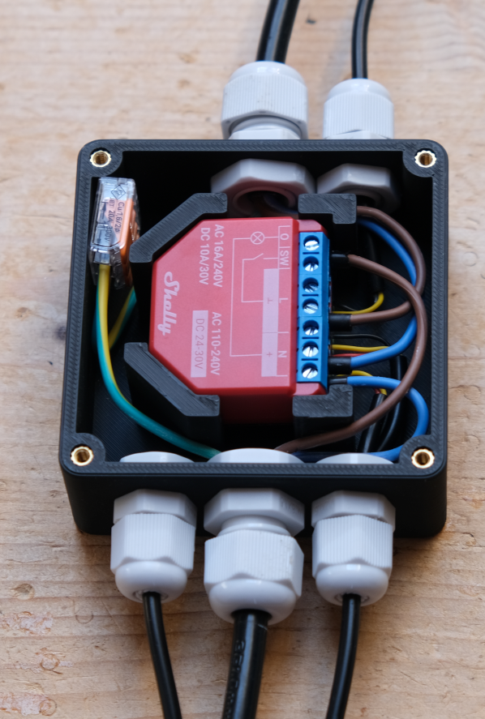
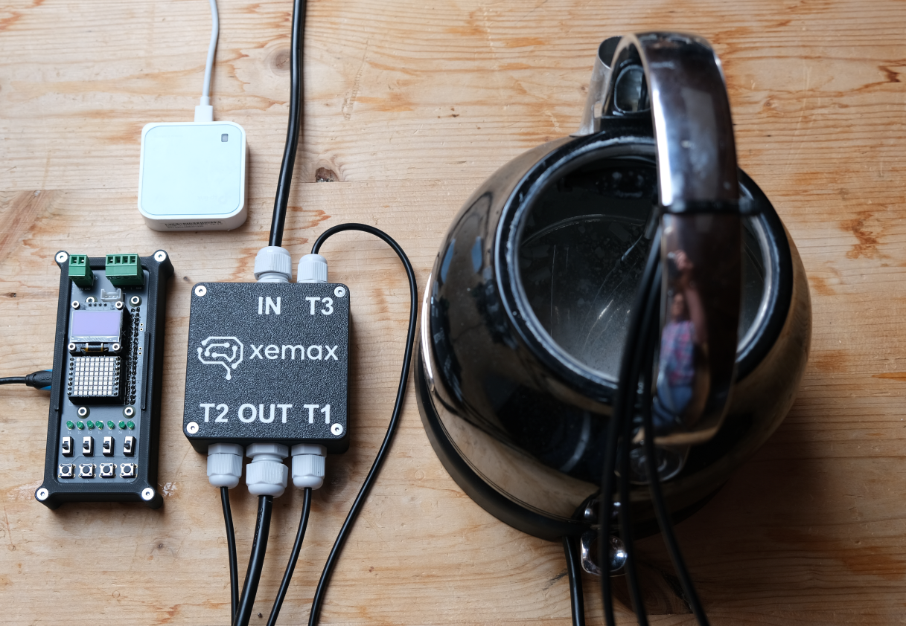
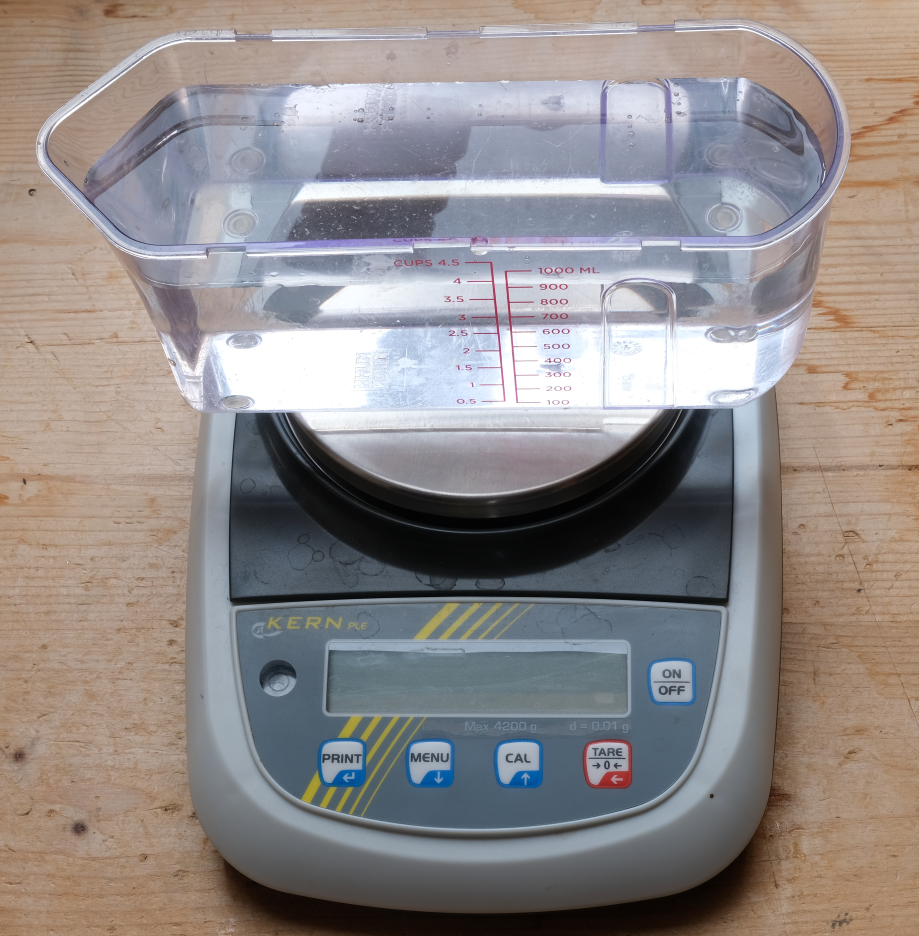

# xLH-thermal-test
Der Thermoversuch zeigt eine exemplarische Umsetzungsstrategie aus der 
Wärmelehre mithilfe moderner Technologien mit Industriebezug.
Die Ankopplung der Aktorik und Sensorik erfolgt via MQTT auf einen
<a href="https://kb.shelly.cloud/knowledge-base/shelly-1pm-gen4" target="_blank">Shelly 1PM</a> 
mit 
1_install_uv_package_manager.bat
sowie 
<a href="https://www.brack.ch/shelly-addon-plus-temperatursensor-set-3-fuer-shelly-plus-aktoren-1495903" target="_blank">3 Temperaturfühlern</a>  
Durch die 

<table>
  <tr>
    <td>
      
    </td>
    <td>
      
    </td>
    <td>
      
    </td>
  </tr>
</table>

## Demonstration
Hinweis: In der Videodemonstration wird der Shelly via REST-API OpcUa Gateway angesteuert. 
Die im Ordner Codesys hinterlegte Version basiert auf dem MQTT Protokoll, welches
Clientseitig vollständig in IEC61131 umgesetzt ist. Im der neusten Version des xLH-Image ist
ein MQTT-Broker integriert.

## Python Notebooks
Die Datenabfrage und Berechnung erfolgt in interaktiven Python Notebooks.
Installation und Start erfolgt mittels Batch-Dateien:

- 0_remove_venv.bat: Lösche die virtuelle Pythonumgebung .venv
- 1_install_uv_package_manager.bat: Installation Python Paketmanager 
    <a href="https://docs.astral.sh/uv/" target="_blank">uv</a> (nur 1x notwendig)
- 2_run_notebooks_jupyter.bat: Starte den Python Notebook Server auf der Basis von 
    <a href="https://jupyter.org/" target="_blank">JupyterLab</a> 

## 3D-Print
<a href="3d_print">3D-Print</a> Daten für den Druck des Gehäuses.